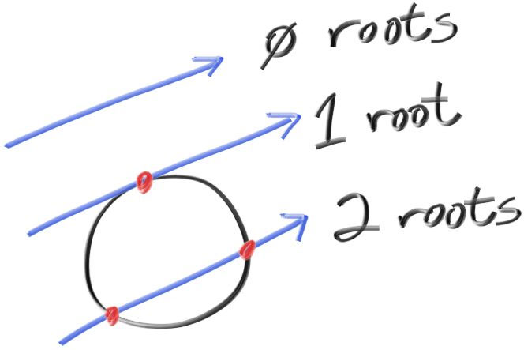
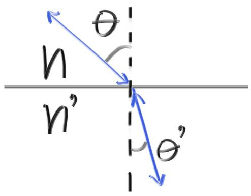

# Notes

## 🖼️ Rendering `.bmp`

`ft_libbmp` implementation based on:

- https://engineering.purdue.edu/ece264/17au/hw/HW15
- https://github.com/marc-q/libbmp
- https://medium.com/sysf/bits-to-bitmaps-a-simple-walkthrough-of-bmp-image-format-765dc6857393

The best way to write the header is to define a `struct`,
set all the values and dump it straight to the file.

```c
typedef struct {             // Total: 54 bytes
  uint16_t  type;             // Magic identifier: 0x4d42
  uint32_t  size;             // File size in bytes
  uint16_t  reserved1;        // Not used
  uint16_t  reserved2;        // Not used
  uint32_t  offset;           // Offset to image data in bytes from beginning of file (54 bytes)
  uint32_t  dib_header_size;  // DIB Header size in bytes (40 bytes)
  int32_t   width_px;         // Width of the image
  int32_t   height_px;        // Height of image
  uint16_t  num_planes;       // Number of color planes
  uint16_t  bits_per_pixel;   // Bits per pixel
  uint32_t  compression;      // Compression type
  uint32_t  image_size_bytes; // Image size in bytes
  int32_t   x_resolution_ppm; // Pixels per meter
  int32_t   y_resolution_ppm; // Pixels per meter
  uint32_t  num_colors;       // Number of colors
  uint32_t  important_colors; // Important colors
} BMPHeader;
```

The only values we need to worry about are `width_px`, `height_px`
and `size`, which we calculate on the fly;
the rest represent configurations
and we can treat them as constants for most purposes.
We then write the actual contents of the file line-by line,
with some padding information.

<p align="center">
  
</p>

My bitmap implementation is very lousy and doesn't handle compression.
This makes for 1080p files that are over 5 mb big.
I transformed all the pictures in the gallery to `.png`
so this README would load faster,
but they were all originally generated as `.bmp` with `ft_libbmp`.

## 🤓 Math <a name = "math"></a>

### 🤝 Conventions

- **Bold** variables are **Euclidean Vectors**, like **`P`** and **`C`**.
- Normal variables are scalars, like `t` and `r`.

### ☀️ Rays

Given a origin **`A`**, and a direction **`b`**,
the linear interpolation of a line with a free variable `t`
generates a ray **`P(t)`**:

<p align="center">
  
</p>

The scalar `t` represents the `translation` of the ray,
or how much it need to advance to reach an arbitrary point in its path.

<p align="center">
  
</p>

### 🔮 Spheres

An arbitrary point **`P`** is on the surface of a sphere
centered in **`C`** with radius `r`
if and only if it satisfies the equation:

<p align="center">
  
</p>

An arbitrary ray **`P(t)`** of origin **`A`** and direction **`b`**
intersects a sphere centered in **`C`** if and only if
`t` is a root of:

<p align="center">
  
</p>

The quadratic above combines equations `(I)` and `(II)`,
and we can solve for `t` with the quadratic formula:

<p align="center">
  
</p>

<p align="center">
  
</p>

<p align="center">
  
</p>

<p align="center">
  
</p>

<p align="center">
  
</p>

### 🕶️ Ray Reflection

The reflection **`r`** of an incident ray **`v`**
on an arbitrary point with a normal **`n`**
can be calculated with:

<p align="center">
  
</p>

<p align="center">
  
</p>

### 🐌 Ray Refraction - Snell's law

Given an angle of `θ` of an incident ray **`R`**,
and the refractive indices of the two surfaces `η` and `η'`,
we calculate the angle `θ'` of the refracted ray **`R'`** with:

<p align="center">
  
</p>

The refracted ray **`R'`** has a perpendicular component **`R′⊥`**
and a parallel component **`R′∥`**,
which we can calculate with:

<p align="center">
  
</p>

<p align="center">
  
</p>

## Tutorials

### Installing miniLibX on Linux

```
git clone https://github.com/42Paris/minilibx-linux.git
cd minilibx-linux
sudo apt install libxext-dev
sudo apt install libxrandr-dev
sudo apt install libx11-dev
sudo apt install libbsd-dev
sudo apt install libssl-dev
make
cd /usr/local/man/
sudo mkdir man1
cd ~
cd minilibx-linux
sudo cp man/man1/* /usr/local/man/man1/
sudo cp libmlx.a /usr/local/lib/
sudo cp mlx.h /usr/local/include/
man mlx
(Deve aparecer o manual do minilibx.)
Depois, no seu projeto, para compilar:
clang -Wall -Wextra -Werror main.c -lbsd -lmlx -lXext -lX11
```

### Finding the hex value of a key press/release

```
no terminal, digitar "xev" pra abrir a ferramenta de debug do teclado.
Apertar a tecla em questão. No stdout, vai aparecer todas as informações
correspondentes. A que queremos é o parâmetro "keysym".

Por exemplo, a tecla ESC dá o seguinte output:

KeyRelease event, serial 37, synthetic NO, window 0x6e00001,
    root 0x540, subw 0x0, time 11114442, (480,959), root:(1855,1044),
    state 0x0, keycode 9 (keysym 0xff1b, Escape), same_screen YES,
    XLookupString gives 1 bytes: (1b) "
FilterEvent returns: False

Então para usar a tecla ESC como parâmetro nas funções da MiniLibX,
usamos 0xFF1B. Por exemplo:

int				close(int keycode, t_vars *vars)
{
    if (keycode == 0xFF1B)
		mlx_destroy_window(vars->mlx, vars->win);
	return (0);
}
```

```bash
KeyRelease event, serial 37, synthetic NO, window 0x3e00001,
    root 0x242, subw 0x0, time 1074842296, (158,-15), root:(1029,454),
    state 0x10, keycode 65 (keysym 0x20, space), same_screen YES,
    XLookupString gives 1 bytes: (20) " "
    XFilterEvent returns: False

KeyPress event, serial 37, synthetic NO, window 0x3e00001,
    root 0x242, subw 0x0, time 1074844007, (157,-15), root:(1028,454),
    state 0x10, keycode 9 (keysym 0xff1b, Escape), same_screen YES,
    XLookupString gives 1 bytes: (1b) "
mbLookupString gives 1 bytes: (1b) "
FilterEvent returns: False

KeyPress event, serial 37, synthetic NO, window 0x3e00001,
    root 0x242, subw 0x0, time 1074844756, (157,-15), root:(1028,454),
    state 0x10, keycode 41 (keysym 0x66, f), same_screen YES,
    XLookupString gives 1 bytes: (66) "f"
    XmbLookupString gives 1 bytes: (66) "f"
    XFilterEvent returns: False
```

## Tips

- Don't forget to normalize the ray before sending it to the canvas.
